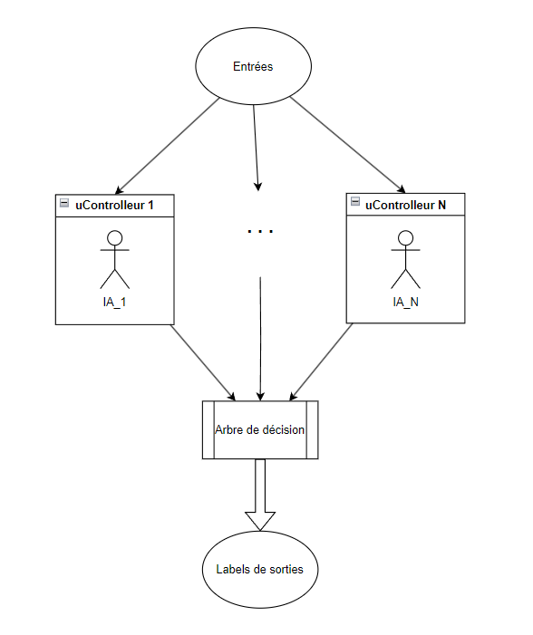
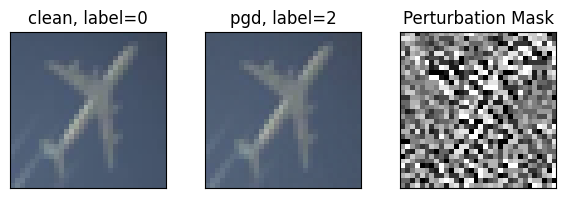
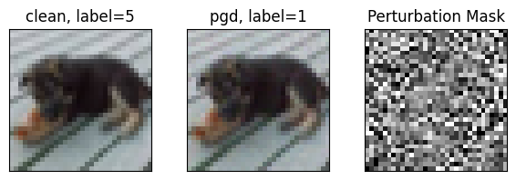

# ES_IA_Embedded_Project

## 1. Analyse du modèle existant (Model0)

Le modèle étudié est une version simplifiée du **VGG11**, adaptée au jeu de données **CIFAR-10**.
Il s’agit d’un **réseau de neurones convolutionnel profond (CNN)** construit de manière séquentielle, comprenant trois blocs convolutionnels suivis de couches entièrement connectées.

### Structure du modèle

Chaque bloc convolutionnel comporte :

* une couche **Conv2D (3×3)**,
* une fonction d’activation **ReLU**,
* une **Batch Normalization** pour stabiliser l’apprentissage,
* une seconde couche **Conv2D (3×3)**,
* une fonction d’activation **ReLU**,
* une **Batch Normalization**,
* un **Dropout** pour régulariser,
* un **MaxPooling(2×2)** pour réduire la taille des cartes de caractéristiques.

Le nombre de filtres appliqués à la première couche de convolution est de 32 et est **multiplié par 2 à chaque bloc**.
Cela permet de conserver un bon ratio entre le nombre de filtres et la taille des données (chaque MaxPooling(2×2) divisant la taille par 4), limitant ainsi la perte d’information.

La partie finale du réseau comprend :

* deux couches denses (1024 et 512 neurones) avec **Dropout(0.3)**,
* une couche de sortie **Softmax** à 10 neurones (correspondant aux classes de CIFAR-10).

Ce type d’architecture atteint généralement **81 % de précision** sur le jeu de test CIFAR-10 et possède **2 916 394 paramètres**.
Cela correspond à un besoin mémoire d’environ **2 Mo 39**, supérieur à la limite de **1 Mo 99**, ce qui **ne le rend pas embarquable** sur notre carte actuelle.

---

## 2. Ensemble Learning

Une de nos idées pour réduire les coûts, augmenter la précision du système et améliorer la robustesse face aux attaques consiste à utiliser une approche **d’Ensemble Learning**.

### Principe

L’Ensemble Learning consiste à faire travailler **plusieurs modèles en parallèle** sur un même input (ici une image de CIFAR-10).
Chaque modèle produit sa propre prédiction, puis un **système de décision** fusionne ces résultats pour produire la classification finale.

Nous envisageons un système composé de **plusieurs petites IA embarquées sur des cartes distinctes**, chacune transmettant son résultat à une carte centrale responsable de la décision finale.

  

Nous avons choisi un **vote à majorité absolue** :
l’image est classée dans le label le plus fréquemment proposé.
En cas d’égalité (peu probable si le nombre de modèles est impair), un tirage aléatoire ou une nouvelle analyse peut être effectué.

Les modèles embarqués seront **similaires**, avec de légères variations (poids initiaux, paramètres d’entraînement ou architecture).

### Objectif

L’objectif est de déterminer **combien de modèles** d’une certaine précision individuelle sont nécessaires pour atteindre une **accuracy globale satisfaisante**, tout en **minimisant le coût matériel**.

La probabilité que la majorité des modèles aient raison correspond à :

$P(X > n/2), \text{ avec } X \sim \text{Binom}(n, p)$

où :

* *n* = nombre de modèles,
* *p* = précision individuelle du modèle,
* *X* = nombre de modèles donnant la bonne prédiction.

  

Le graphique montre qu’il est préférable d’utiliser un **nombre impair de modèles** pour éviter les égalités.
Des modèles avec une précision individuelle de **plus de 75 %** permettent d’atteindre une précision globale **supérieure à 90 %** dès **4 modèles**.

---

## 3. Modèle 19

### Caractéristiques sans compression

* **Flash** : 268 Ko
* **RAM** : 85,7 Ko
* **Opérations** : ~8,5 M
* **Précision** : 80 % (**à revalider sur carte**)

### Caractéristiques avec compression élevée

* **Flash** : 235 Ko
* **RAM** : 85,7 Ko
* **Opérations** : ~8,5 M
* **Précision** : 80 % (**à revalider sur carte**)

Ce modèle, de par sa **faible empreinte mémoire** et sa précision satisfaisante, est un **bon candidat pour l’approche Ensemble Learning**.

Sa taille réduite permet son déploiement sur des **cartes à bas coût**, tout en laissant de la mémoire disponible pour d’autres fonctions.
Plusieurs IA peuvent éventuellement être implantées sur une même carte, au prix d’un temps d’inférence plus élevé.

---

## 4. Cartes proposées

### a) NUCLEO-G0B1RE

* **Flash** : 256 Ko
* **RAM** : 144 Ko
* **Cœur** : ARM Cortex-M0+, 64 MHz
* **Prix** : < 18 €

Assez de mémoire pour embarquer le modèle et communiquer via UART.
Son coût environ **5,3 fois inférieur** à la carte d’origine permettrait d’utiliser **5 modèles en ensemble learning**, pour une précision théorique d’environ **94,5 %**.
Mode basse consommation disponible.

**Inconvénients** : CPU ancien et fréquence limitée (64 MHz), donnant un **temps d’inférence estimé à 132 ms**.

---

### b) NUCLEO-F446RE

* **Flash** : 512 Ko
* **RAM** : 128 Ko
* **Cœur** : ARM Cortex-M4, 180 MHz
* **Prix** : < 20 €

Carte plus rapide tout en restant abordable.
Précision théorique similaire : **94,5 %** en ensemble learning.
**Avantages** : inférence rapide (~66 ms).
**Inconvénient** : absence de mode basse consommation documenté.

---

### c) NUCLEO-L452RE

* **Flash** : 512 Ko
* **RAM** : 160 Ko
* **Cœur** : ARM Cortex-M4, 80 MHz
* **Prix indicatif** : ~15 €

Bon rapport performance/prix.
Permet d’embarquer plusieurs modèles pour atteindre **94,5 %** de précision.
**Avantages** : présence d’un mode basse consommation.
**Inconvénients** : fréquence modérée, **temps d’inférence ≈ 106 ms**.

---

## 5. Sécurité

L’utilisation de plusieurs modèles à faible coût renforce la **résilience globale du système**.
Cependant, chaque modèle reste individuellement vulnérable, d’où la nécessité d’étudier leur robustesse face à différentes attaques.

### a) Attaques adversariales

Une **attaque adversariale** consiste à **ajouter un bruit subtil** à une image pour provoquer une mauvaise classification.
Nous avons testé deux types d’attaques : **FGSM** et **PGD** (en boîte blanche).

**Masques obtenue pour un budget de 0,01 et un step de 0,001**

  

**Masques obtenue pour un budget de 0,05 et un step de 0,005**

  

  

Les tests montrent que :

* l’attaque **PGD** est plus efficace que **FGSM** à budget égal ;
* la perturbation visuelle reste à peine perceptible pour l’humain ;
* la précision chute de **90 % à environ 35 %**.

Ainsi, le modèle n’est **pas robuste** à ces attaques.
De plus, la similarité entre modèles rend l’ensemble learning **également vulnérable**, car une même perturbation affectera plusieurs modèles.

#### Protection

Nous avons ensuite testé une **adversarial training**, en introduisant des images bruitées dans les batches d’entraînement.
Cette méthode rallonge le temps d’entraînement, mais améliore la résistance du modèle.

> (**Résultats à développer et illustrer**)

---

### b) Bit Flip

Le protocole actuel n’attaque qu’un seul modèle à la fois ; nous ne pouvons donc pas encore évaluer la résistance de **l’ensemble complet** à une attaque physique (type laser).

---

## 6. Conclusion (provisoire)

Le **modèle light 233k_80** constitue un **excellent compromis** entre taille mémoire, coût et précision.
Il est adapté à un **déploiement multi-carte** en ensemble learning, permettant d’améliorer la précision globale tout en réduisant les coûts.

Des tests complémentaires sont nécessaires :

* validation sur carte réelle,
* diversification des entraînements pour réduire la corrélation des erreurs,
* évaluation approfondie de la robustesse (bruit, laser, bit flip, etc.).

---

## 7. Modèle 5 compressé

### Caractéristiques (compression élevée)

* **Flash** : 1,25 Mo
* **RAM** : 147,87 Ko
* **Opérations** : ~39,3 M
* **Précision** : 88 % (**à revalider sur carte**)

Ce modèle présente une **excellente précision** et reste **intégrable sur la carte STM32L4R9** après compression, tout en laissant suffisamment de mémoire disponible pour d’autres fonctions.

---

### Carte NUCLEO-L4R9

> Détails à compléter.

---

### Sécurité

Comme pour le modèle précédent, nous avons testé la robustesse face à des attaques adversariales et appliqué des techniques de protection.

#### Attaques adversariales

> **Graphiques et masques à insérer ici**

Le modèle reste sensible à ce type d’attaque : une petite perturbation (invisible à l’œil humain) peut réduire fortement l’accuracy.

#### Protection

> **Image avec masques à insérer**

#### Bit Flip

Même remarque : les tests actuels n’évaluent qu’un modèle isolé, pas l’ensemble.

---

## Conclusion (provisoire)

Le **modèle 5 compressé** offre un bon compromis entre performance et compatibilité embarquée.
Combiné à l’approche **Ensemble Learning**, il pourrait constituer une base robuste et scalable pour le projet.

---

