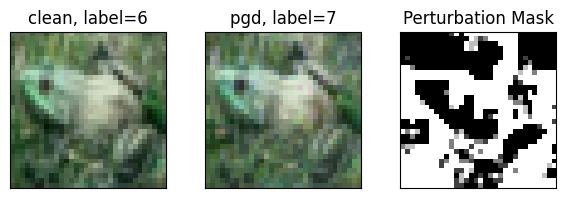

# ES_IA_Embedded_Project

## Auteurs
- Hugo CELARIE
- Téano DESHAIES

## Arborescence et description des fichiers

### Codes
Contient les programmes utilisés pour implémenter les modèles sur cartes et les tester :

- `Communication_NN.py` : script Python permettant de tester un modèle implémenté sur la carte.  
- `Projet_CUBE.zip` : projet STM32CubeIDE utilisé pour déployer les modèles sur la carte **NUCLEO-L4R9IDISCOVERY**.

### Historique des modèles
Répertoire stockant l'ensemble des modèles réalisés (`.h5`), leurs rapports d'analyse (`.txt`) ainsi que l'historique détaillé avec leurs caractéristiques (`Création_du_modèle.txt`). Contient également un **Jupyter Notebook** ayant servi à préparer les différents modèles.

### Modèles retenus
Contient les modèles qui ont été retenus suite aux tests. Ces modèles sont ceux traités dans le rapport ; leur nomenclature (`Modele_N`) n'est pas corrélée à l'historique des modèles.

### Rapport_analyses
Contient de nombreux rapports d'analyse des modèles générés (rapports produits par STM32CubeIDE).

### Sécurité
Contient les résultats des tests d'attaque sur les modèles retenus (bit-flip et attaques adversariales).

## Introduction

Ce document présente une analyse complète des **modèles d’intelligence artificielle** développés pour la **reconnaissance d’images CIFAR-10**, ainsi que leur **optimisation**, leur **implémentation embarquée** et leur **évaluation en matière de sécurité**.  

L’objectif de ce projet est de **proposer un ou plusieurs modèles adaptés à des plateformes STM32**, en conciliant **précision**, **consommation mémoire** et **temps d’inférence**, tout en garantissant une **robustesse face aux attaques**.  

Ce README détaille donc les différentes étapes du travail réalisé :
- la **conception et l’analyse** des modèles,
- le **processus de compression et d’optimisation** pour l’embarqué,
- la **mise en œuvre sur carte STM32**,
- et enfin, les **tests de sécurité** (attaques adversariales, bit-flip, etc.) permettant d’évaluer la résilience des solutions proposées.

Ce rapport analysera principalement **trois modèles**, selon la méthodologie suivante :  
- **Analyse détaillée des modèles** : étude de leurs architectures, performances et contraintes.  
- **Proposition de cartes d’embarquement** et description des **méthodes d’intégration** adaptées.  
- **Évaluation des techniques de sécurisation** et de la **résistance des modèles** face aux attaques, notamment les **Bit Flip Attacks** et les **Adversarial Attacks**.

## 1. Analyse du modèle existant (Model0)

Le modèle étudié est une version simplifiée du **VGG11**, adaptée au jeu de données **CIFAR-10**.
Il s’agit d’un **réseau de neurones convolutionnel profond (CNN)** construit de manière séquentielle, comprenant trois blocs convolutionnels suivis de couches entièrement connectées.

### Structure du modèle

Chaque bloc convolutionnel comporte :

* une couche **Conv2D (3×3)**,
* une fonction d’activation **ReLU**,
* une **Batch Normalization** pour stabiliser l’apprentissage,
* une seconde couche **Conv2D (3×3)**,
* une fonction d’activation **ReLU**,
* une **Batch Normalization**,
* un **Dropout** pour régulariser,
* un **MaxPooling(2×2)** pour réduire la taille des cartes de caractéristiques.

Le nombre de filtres appliqués à la première couche de convolution est de 32 et est **multiplié par 2 à chaque bloc**.
Cela permet de conserver un bon ratio entre le nombre de filtres et la taille des données (chaque MaxPooling(2×2) divisant la taille par 4), limitant ainsi la perte d’information.

La partie finale du réseau comprend :

* deux couches denses (1024 et 512 neurones) avec **Dropout(0.3)**,
* une couche de sortie **Softmax** à 10 neurones (correspondant aux classes de CIFAR-10).

Ce type d’architecture atteint généralement **81 % de précision** sur le jeu de test CIFAR-10 et possède **2 916 394 paramètres**.
Cela correspond à un besoin mémoire d’environ **2 Mo 39**, supérieur à la limite de **1 Mo 99**, ce qui **ne le rend pas embarquable** sur notre carte actuelle.

---

## 2. Ensemble Learning

Une de nos idées pour réduire les coûts, augmenter la précision du système et améliorer la robustesse face aux attaques consiste à utiliser une approche **d’Ensemble Learning**.

### Principe

L’Ensemble Learning consiste à faire travailler **plusieurs modèles en parallèle** sur un même input (ici une image de CIFAR-10).
Chaque modèle produit sa propre prédiction, puis un **système de décision** fusionne ces résultats pour produire la classification finale.

Nous envisageons un système composé de **plusieurs petites IA embarquées sur des cartes distinctes**, chacune transmettant son résultat à une carte centrale responsable de la décision finale.

  

Nous avons choisi un **vote à majorité absolue** :
l’image est classée dans le label le plus fréquemment proposé.
En cas d’égalité (peu probable si le nombre de modèles est impair), un tirage aléatoire ou une nouvelle analyse peut être effectué.

Les modèles embarqués seront **similaires**, avec de légères variations (poids initiaux, paramètres d’entraînement ou architecture).

### Objectif

L’objectif est de déterminer **combien de modèles** d’une certaine précision individuelle sont nécessaires pour atteindre une **accuracy globale satisfaisante**, tout en **minimisant le coût matériel**.

La probabilité que la majorité des modèles aient raison correspond à :

$P(X > n/2), \text{ avec } X \sim \text{Binom}(n, p)$

où :

* *n* = nombre de modèles,
* *p* = précision individuelle du modèle,
* *X* = nombre de modèles donnant la bonne prédiction.

  

Le graphique montre qu’il est préférable d’utiliser un **nombre impair de modèles** pour éviter les égalités.
Des modèles avec une précision individuelle de **plus de 75 %** permettent d’atteindre une précision globale **supérieure à 90 %** dès **4 modèles**.

---

## 3. Modèle 19

### Caractéristiques sans compression

* **Flash** : 268 Ko
* **RAM** : 85,7 Ko
* **Opérations** : ~8,5 M
* **Précision** : 82 %

### Caractéristiques avec compression élevée

* **Flash** : 235 Ko
* **RAM** : 85,7 Ko
* **Opérations** : ~8,5 M
* **Précision** : 83 %

Ce modèle, de par sa **faible empreinte mémoire** et sa précision satisfaisante, est un **bon candidat pour l’approche Ensemble Learning**.

Sa taille réduite permet son déploiement sur des **cartes à bas coût**, tout en laissant de la mémoire disponible pour d’autres fonctions.
Plusieurs IA peuvent éventuellement être implantées sur une même carte, au prix d’un temps d’inférence plus élevé.

---

## 4. Cartes proposées

### a) NUCLEO-G0B1RE

* **Flash** : 256 Ko
* **RAM** : 144 Ko
* **Cœur** : ARM Cortex-M0+, 64 MHz
* **Prix** : < 18 €

Assez de mémoire pour embarquer le modèle et communiquer via UART.\
Son coût environ **5,3 fois inférieur** à la carte d’origine permettrait d’utiliser **5 modèles en ensemble learning**, pour une précision théorique d’environ **94,5 %**.\
Mode basse consommation disponible.

**Inconvénients** : CPU ancien et fréquence limitée (64 MHz), donnant un **temps d’inférence estimé à 132 ms**.

---

### b) NUCLEO-F446RE

* **Flash** : 512 Ko
* **RAM** : 128 Ko
* **Cœur** : ARM Cortex-M4, 180 MHz
* **Prix** : < 20 €

Carte plus rapide tout en restant abordable.
Précision théorique similaire : **94,5 %** en ensemble learning.\
**Avantages** : inférence rapide (~66 ms).\
**Inconvénient** : absence de mode basse consommation documenté.

---

### c) NUCLEO-L452RE

* **Flash** : 512 Ko
* **RAM** : 160 Ko
* **Cœur** : ARM Cortex-M4, 80 MHz
* **Prix indicatif** : ~15 €

Bon rapport performance/prix.\
Permet d’embarquer plusieurs modèles pour atteindre **94,5 %** de précision.\
**Avantages** : présence d’un mode basse consommation.\
**Inconvénients** : fréquence modérée, **temps d’inférence ≈ 106 ms**.

---

## 5. Sécurité (pour 1 modele)

L’utilisation de plusieurs modèles à faible coût renforce la **résilience globale du système**.\
Cependant, chaque modèle reste individuellement vulnérable, d’où la nécessité d’étudier leur robustesse face à différentes attaques.

### a) Attaques adversariales

Une **attaque adversariale** consiste à **ajouter un bruit subtil** à une image pour provoquer une mauvaise classification.\
Nous avons testé deux types d’attaques : **FGSM** et **PGD** (en boîte blanche).

**Masques obtenue pour un budget de 0,01 et un step de 0,001**

  

**Masques obtenue pour un budget de 0,05 et un step de 0,005**

  

  

Les tests montrent que :

* l’attaque **PGD** est plus efficace que **FGSM** à budget égal ;
* la perturbation visuelle reste à peine perceptible pour l’humain ;
* la précision chute de **90 % à environ 35 %**.

Ainsi, le modèle n’est **pas robuste** à ces attaques.\
De plus, la similarité entre modèles rend l’ensemble learning **également vulnérable**, car une même perturbation affectera plusieurs modèles.

### Protection

Nous avons ensuite testé une **adversarial training**, en introduisant des images bruitées dans les batches d’entraînement.\
Cette méthode rallonge le temps d’entraînement, mais améliore la résistance du modèle.

  

On constate qu'avec un modèle entraîné, le masque qui doit être appliqué pour perturber la classification est plus visible sur l'image.

Voici un détail de la pression du modèle protégé face au modèle sans protection pour un budget de 0,1 et un step de 0,05:

| Modèle        | Test acc. (clean) [%] | Test acc. (FGM) [%] | Test acc. (PGD) [%] |
|----------------|-----------------------|----------------------|----------------------|
| **Non protégé** | 79.90                | 15.03                | 6.91                 |
| **Protégé**     | 54.27                | 40.87                | 36.81                |

Cette protection a permis au modèle d'augmenter significativement sa précision en cas d'attaque, pour une attaque demandant un grand budget. Mais la protection fait fortement diminuer la précision du modèle si aucune attaque n'est menée.

---

### b) Bit Flip

---

## 6. Conclusion (provisoire)

Le **modèle light 233k_80** constitue un **excellent compromis** entre taille mémoire, coût et précision.\
Il est adapté à un **déploiement multi-carte** en ensemble learning, permettant d’améliorer la précision globale tout en réduisant les coûts.

Des tests complémentaires sont nécessaires :

* validation sur carte réelle,
* diversification des entraînements pour réduire la corrélation des erreurs,
* évaluation approfondie de la robustesse (bruit, laser, bit flip, etc.).

---

## 7. Modèle 5 compressé

### Caractéristiques (compression élevée)

* **Flash** : 1,25 Mo
* **RAM** : 147,87 ko
* **Opérations** : ~39,3 M
* **Précision** : 90 %

Ce modèle présente une **excellente précision** et reste **intégrable sur la carte STM32L4R9** après compression, tout en laissant suffisamment de mémoire disponible pour d’autres fonctions.

Au vu de la taille du modèle et des coûts en mémoire RAM et du nombre d'opérations demandé. Peu de cartes peuvent permettre une embarcation à un coût équivalent ou inférieur à la carte initialement proposée.

---

### Carte NUCLEO-L4R9IDISCOVERY

* **Flash** : 2 Mo
* **RAM** : 640 Ko
* **Cœur** : ARM Cortex-M4, 120 MHz
* **Prix indicatif** : ~30 €

Cette carte haut de gamme de la série L4, adaptée aux applications **IA embarquée** permet d’embarquer des modèles complexes tout en conservant une consommation énergétique maîtrisée.\
**Avantages** : grande mémoire, fréquence élevée (**temps d'inférence = 327ms**), nombreux périphériques intégrés (accéléromètre, gyroscope, écran LCD).\
**Inconvénients** : coût élevé, carte volumineuse.

---

## 8. Sécurité

Comme pour le modèle précédent, nous avons testé la robustesse face à des attaques adversariales et appliqué des techniques de protection.

### a) Attaques adversariales

**Masques obtenue pour un budget de 0,01 et un step de 0,001**

  

  

Les conclusions sur la vulnérabilité du Model 5 par rapport aux attaques adversarial restent les mêmes que pour celles du Model 19.\
Le modèle reste très sensible à ce type d’attaque : une petite perturbation (invisible à l’œil humain) peut réduire fortement la précision du modèle.

### Protection

Nous avons ensuite proteger notre model de la meme maniére que le modele 19.

  

Voici un détail de la pression du modèle protégé face au modèle sans protection pour un budget de 0,1 et un step de 0,05:

| Modèle        | Test acc. (clean) [%] | Test acc. (FGM) [%] | Test acc. (PGD) [%] |
|----------------|-----------------------|----------------------|----------------------|
| **Non protégé** | 88.29                | 22.62                | 7.88                 |
| **Protégé**     | 68.37                | 47.00                | 39.71                |

On constate que le masque appliqué sur l'image se voit bien plus que celui sur le modèle 19. Cependant, le modèle reste sensible aux attaques mais garde une précision jugée correcte, que ce soit en subissant une attaque ou non.

### b) Bit Flip

---

## 9. Conclusion (provisoire)

Le **modèle 5 compressé** offre un bon compromis entre performance et compatibilité embarquée.
Combiné à l’approche **Ensemble Learning**, il pourrait constituer une base robuste et scalable pour le projet.

---

## 10. Modèle 2

### Caractéristiques (compression élevée)

* **Flash** : 139,24 Ko  
* **RAM** : 145,30 Ko  
* **Opérations** : ~15,35 M  
* **Précision** : 81 %

---

### Carte NUCLEO-L4R9IDISCOVERY

Les cartes proposées pour ce modèle sont identiques à celles du **modèle 5**.  

En effet, la **consommation mémoire RAM** de ce modèle est relativement élevée, ce qui limite son déploiement sur des cartes **à bas coût**.  
De plus, bien qu’il nécessite environ **deux fois plus d’opérations** que le modèle 19 pour effectuer une inférence, il occupe **près de deux fois moins d’espace Flash**.  

Ainsi, nous proposons de l’intégrer sur une **carte disposant d’une grande capacité Flash** et d’une **RAM suffisante** pour permettre la mise en œuvre d’un **ensemble learning** directement sur une seule carte.  
Dans cette configuration, les modèles fonctionneraient **en série** (les uns après les autres) plutôt qu’en **parallèle** (tous simultanément), optimisant ainsi l’utilisation des ressources disponibles.

L’avantage principal de cette approche est qu’elle permet d’obtenir une **précision élevée** sans augmenter ni l’**encombrement physique**, ni l’**espace de stockage** utilisé sur la carte.  

En revanche, cette méthode **augmente significativement le temps d’inférence** : celui-ci est d’environ **0,128 s** pour un modèle unique, mais il est multiplié par le nombre de modèles embarqués.  

Il est possible d’intégrer environ **11 modèles** sur la carte tout en conservant suffisamment de mémoire pour un **processus de décision** et d’autres **applications complémentaires**.\
Dans cette configuration, la précision théorique pourrait atteindre **jusqu’à 99 %**, mais le **temps d’inférence total** s’élèverait alors à environ **1,408 s**.

---

## 11. Sécurité (pour 1 modele)

Comme pour les modèles précédent, nous avons testé la robustesse face à des attaques adversariales et appliqué des techniques de protection.

### a) Attaques adversariales

**Masques obtenue pour un budget de 0,05 et un step de 0,005**

  

  

Les conclusions sur la vulnérabilité du Model 2 par rapport aux attaques adversaires restent les mêmes que pour celles du Model 19, au détail près que le modèle semble plus vulnérable aux attaques FGSM que les autres.
De plus, si le modèle est implémenté en ensemble learning, alors les perturbations peuvent affecter tous les modèles implémentés de manière similaire, le rendant donc encore plus vulnérable à ce type d'attaque.

### Protection

Nous avons ensuite proteger notre model de la meme maniére que le modele 19.

  

Voici un détail de la pression du modèle protégé face au modèle sans protection pour un budget de 0,1 et un step de 0,05:

| Modèle        | Test acc. (clean) [%] | Test acc. (FGM) [%] | Test acc. (PGD) [%] |
|----------------|-----------------------|----------------------|----------------------|
| **Non protégé** | 82.02                | 8.95               | 10.05                 |
| **Protégé**     | 57.29                | 40.10               | 35.53                |

On constate que le masque appliqué sur l'image se voit bien plus que celui sur le modèle 19. Cependant, le modèle reste sensible aux attaques mais garde une précision jugée correcte sans attaques (proche du modèle 5) et la protection appliquée permet au modèle de garder une précision "correcte" en cas d'attaque.

### b) Bit Flip

---

## 12. Conclusion (provisoire)

Le **modèle 5 compressé** offre un bon compromis entre performance et compatibilité embarquée.
Combiné à l’approche **Ensemble Learning**, il pourrait constituer une base robuste et scalable pour le projet.

---