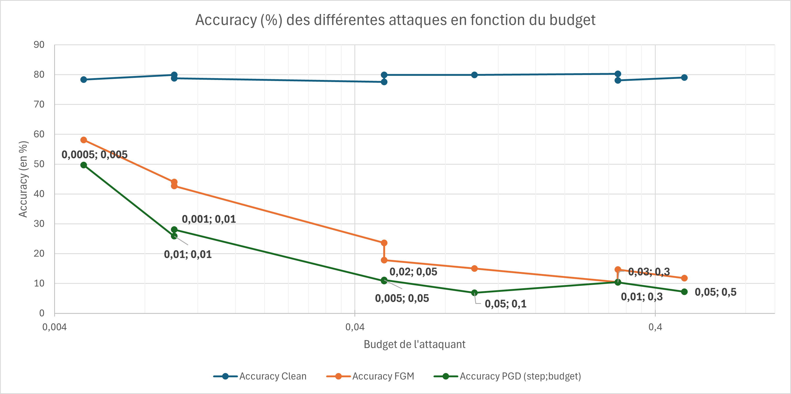

# ES_IA_Embedded_Project

## Auteurs
- Hugo CELARIE
- Téano DESHAIES

## Arborescence et description des fichiers

### Codes
Contient les programmes utilisés pour implémenter les modèles sur cartes et les tester :

- `Communication_NN.py` : script Python permettant de tester un modèle implémenté sur la carte.  
- `Projet_CUBE_modeleX.zip` : projet STM32CubeIDE utilisé pour déployer du modèle X (2, 5 ou 19_8_compression (Hight, None)) sur la carte **NUCLEO-L4R9IDISCOVERY**.

### Historique des modèles
Répertoire stockant l'ensemble des modèles réalisés (`.h5`), leurs rapports d'analyse (`.txt`) ainsi que l'historique détaillé avec leurs caractéristiques (`Création_du_modèle.txt`). Contient également un **Jupyter Notebook** ayant servi à préparer les différents modèles.

### Modèles retenus
Contient les modèles qui ont été retenus suite aux tests. Ces modèles sont ceux traités dans le rapport ; leur nomenclature (`Modele_N`) n'est pas corrélée à l'historique des modèles. Ce répertoire contient aussi les données d'entraînement et de test.

### Rapport_analyses
Contient de nombreux rapports d'analyse des modèles générés (rapports produits par STM32CubeIDE).

### Sécurité
Contient les résultats des tests d'attaque sur les modèles retenus (bit-flip et attaques adversariales).

## Introduction

Ce document présente une analyse complète des **modèles d’intelligence artificielle** développés pour la **reconnaissance d’images CIFAR-10**, ainsi que leur **optimisation**, leur **implémentation embarquée** et leur **évaluation en matière de sécurité**.  

L’objectif de ce projet est de **proposer un ou plusieurs modèles adaptés à des plateformes STM32**, en conciliant **précision**, **consommation mémoire** et **temps d’inférence**, tout en garantissant une **robustesse face aux attaques**.  

Ce README détaille donc les différentes étapes du travail réalisé :
- la **conception et l’analyse** des modèles,
- le **processus de compression et d’optimisation** pour l’embarqué,
- la **mise en œuvre sur carte STM32**,
- et enfin, les **tests de sécurité** (attaques adversariales, bit-flip, etc.) permettant d’évaluer la résilience des solutions proposées.

Ce rapport analysera principalement **trois modèles**, selon la méthodologie suivante :  
- **Analyse détaillée des modèles** : étude de leurs architectures, performances et contraintes.  
- **Proposition de cartes d’embarquement** et description des **méthodes d’intégration** adaptées.  
- **Évaluation des techniques de sécurisation** et de la **résistance des modèles** face aux attaques, notamment les **Bit Flip Attacks** et les **Adversarial Attacks**.

## 1. Analyse du modèle existant (Model0)

Le modèle étudié est une version simplifiée du **VGG11**, adaptée au jeu de données **CIFAR-10**.
Il s’agit d’un **réseau de neurones convolutionnel profond (CNN)** construit de manière séquentielle, comprenant trois blocs convolutionnels suivis de couches entièrement connectées.

### Structure du modèle

Chaque bloc convolutionnel comporte :

* une couche **Conv2D (3×3)**,
* une fonction d’activation **ReLU**,
* une **Batch Normalization** pour stabiliser l’apprentissage,
* une seconde couche **Conv2D (3×3)**,
* une fonction d’activation **ReLU**,
* une **Batch Normalization**,
* un **Dropout** pour régulariser,
* un **MaxPooling(2×2)** pour réduire la taille des cartes de caractéristiques.

Le nombre de filtres appliqués à la première couche de convolution est de 32 et est **multiplié par 2 à chaque bloc**.
Cela permet de conserver un bon ratio entre le nombre de filtres et la taille des données (chaque MaxPooling(2×2) divisant la taille par 4), limitant ainsi la perte d’information.

La partie finale du réseau comprend :

* deux couches denses (1024 et 512 neurones) avec **Dropout(0.3)**,
* une couche de sortie **Softmax** à 10 neurones (correspondant aux classes de CIFAR-10).

Ce type d’architecture atteint généralement **81 % de précision** sur le jeu de test CIFAR-10 et possède **2 916 394 paramètres**.
Cela correspond à un besoin mémoire d’environ **2 Mo 39**, supérieur à la limite de **1 Mo 99**, ce qui **ne le rend pas embarquable** sur notre carte actuelle.

---

## 2. Ensemble Learning

Une de nos idées pour réduire les coûts, augmenter la précision du système et améliorer la robustesse face aux attaques consiste à utiliser une approche **d’Ensemble Learning**.

### Principe

L’Ensemble Learning consiste à faire travailler **plusieurs modèles en parallèle** sur un même input (ici une image de CIFAR-10).
Chaque modèle produit sa propre prédiction, puis un **système de décision** fusionne ces résultats pour produire la classification finale.

Nous envisageons un système composé de **plusieurs petites IA embarquées sur des cartes distinctes**, chacune transmettant son résultat à une carte centrale responsable de la décision finale.

  

Nous avons choisi un **vote à majorité absolue** :
l’image est classée dans le label le plus fréquemment proposé.
En cas d’égalité (peu probable si le nombre de modèles est impair), un tirage aléatoire ou une nouvelle analyse peut être effectué.

Les modèles embarqués seront **similaires**, avec de légères variations (poids initiaux, paramètres d’entraînement ou architecture).

### Objectif

L’objectif est de déterminer **combien de modèles** d’une certaine précision individuelle sont nécessaires pour atteindre une **accuracy globale satisfaisante**, tout en **minimisant le coût matériel**.

La probabilité que la majorité des modèles aient raison correspond à :

$P(X > n/2), \text{ avec } X \sim \text{Binom}(n, p)$

où :

* *n* = nombre de modèles,
* *p* = précision individuelle du modèle,
* *X* = nombre de modèles donnant la bonne prédiction.

  

Le graphique montre qu’il est préférable d’utiliser un **nombre impair de modèles** pour éviter les égalités.
Des modèles avec une précision individuelle de **plus de 75 %** permettent d’atteindre une précision globale **supérieure à 90 %** dès **4 modèles**.

---

## 3. Modèle 19

Le modèle **`Model19`**, repose sur l’utilisation d’un bloc personnalisé, **`Resnet_block`**, qui introduit des connexions résiduelles afin de faciliter la propagation du gradient et d’améliorer la stabilité de l’entraînement. Chaque bloc **ResNet** commence par une vérification du nombre de canaux d’entrée : si celui-ci diffère du nombre de filtres requis, un **chemin de raccourci (shortcut)** est ajusté via une convolution 1×1 suivie d’une **Batch Normalization**. Le cœur du bloc effectue plusieurs combinaisons convolutionnelles (**num_comb**) avec des filtres de taille variable (**size**) et des activations **ReLU**, avant d’ajouter le résultat au chemin de raccourci pour former une **somme résiduelle**. L’ensemble est ensuite normalisé et réactivé pour stabiliser l’apprentissage.  
Le modèle principal commence par une convolution initiale à **8 filtres (3×3)** suivie d’une normalisation et d’une activation **ReLU**, puis enchaîne plusieurs **blocs résiduels** : deux blocs à 8 filtres, suivis d’un **MaxPooling (2×2)** et d’un **Dropout(0.2)** ; puis deux autres blocs à 16 filtres, suivis d’un pooling et d’un **Dropout(0.3)**. Ensuite, le réseau ajoute des convolutions classiques à **32 puis 64 filtres**, chacune normalisée et activée, entrecoupées de **MaxPooling2D** et de **Dropout** pour la régularisation. Enfin, la partie classification utilise une **GlobalAveragePooling2D** pour réduire la dimension spatiale, suivie d’une couche **Dense(128, ReLU)**, d’un **Dropout(0.35)**, et d’une sortie **Dense(10, softmax)** correspondant aux dix classes du jeu **CIFAR-10**.  

### Caractéristiques sans compression

* **Flash** : 268 Ko
* **RAM** : 85,7 Ko
* **Opérations** : ~8,5 M
* **Précision** : 82 %

### Caractéristiques avec compression élevée

* **Flash** : 235 Ko
* **RAM** : 85,7 Ko
* **Opérations** : ~8,5 M
* **Précision** : 83 %

Ce modèle, de par sa **faible empreinte mémoire** et sa précision satisfaisante, est un **bon candidat pour l’approche Ensemble Learning**.

Sa taille réduite permet son déploiement sur des **cartes à bas coût**, tout en laissant de la mémoire disponible pour d’autres fonctions.
Plusieurs IA peuvent éventuellement être implantées sur une même carte, au prix d’un temps d’inférence plus élevé.

---

## 4. Cartes proposées

### a) NUCLEO-G0B1RE

* **Flash** : 256 Ko
* **RAM** : 144 Ko
* **Cœur** : ARM Cortex-M0+, 64 MHz
* **Prix** : < 18 €

Assez de mémoire pour embarquer le modèle et communiquer via UART.\
Son coût environ **5,3 fois inférieur** à la carte d’origine permettrait d’utiliser **5 modèles en ensemble learning**, pour une précision théorique d’environ **94,5 %**.\
Mode basse consommation disponible.

**Inconvénients** : CPU ancien et fréquence limitée (64 MHz), donnant un **temps d’inférence estimé à 132 ms**.

---

### b) NUCLEO-F446RE

* **Flash** : 512 Ko
* **RAM** : 128 Ko
* **Cœur** : ARM Cortex-M4, 180 MHz
* **Prix** : < 20 €

Carte plus rapide tout en restant abordable.
Précision théorique similaire : **94,5 %** en ensemble learning.\
**Avantages** : inférence rapide (~66 ms).\
**Inconvénient** : absence de mode basse consommation documenté.

---

### c) NUCLEO-L452RE

* **Flash** : 512 Ko
* **RAM** : 160 Ko
* **Cœur** : ARM Cortex-M4, 80 MHz
* **Prix indicatif** : ~15 €

Bon rapport performance/prix.\
Permet d’embarquer plusieurs modèles pour atteindre **94,5 %** de précision.\
**Avantages** : présence d’un mode basse consommation.\
**Inconvénients** : fréquence modérée, **temps d’inférence ≈ 106 ms**.

---

## 5. Sécurité (pour 1 modele)

L’utilisation de plusieurs modèles à faible coût renforce la **résilience globale du système**.\
Cependant, chaque modèle reste individuellement vulnérable, d’où la nécessité d’étudier leur robustesse face à différentes attaques.

### a) Attaques adversariales

Une **attaque adversariale** consiste à **ajouter un bruit subtil** à une image pour provoquer une mauvaise classification.\
Nous avons testé deux types d’attaques : **FGSM** et **PGD** (en boîte blanche).

**Masques obtenue pour un budget de 0,01 et un step de 0,001**

  

**Masques obtenue pour un budget de 0,05 et un step de 0,005**

  

  

Les tests montrent que :

* l’attaque **PGD** est plus efficace que **FGSM** à budget égal ;
* la perturbation visuelle reste à peine perceptible pour l’humain ;
* la précision chute de **90 % à environ 35 %**.

Ainsi, le modèle n’est **pas robuste** à ces attaques.\
De plus, la similarité entre modèles rend l’ensemble learning **également vulnérable**, car une même perturbation affectera plusieurs modèles.

### Protection

Nous avons ensuite testé une **adversarial training**, en introduisant des images bruitées dans les batches d’entraînement.\
Cette méthode rallonge le temps d’entraînement, mais améliore la résistance du modèle.

  

On constate qu'avec un modèle entraîné, le masque qui doit être appliqué pour perturber la classification est plus visible sur l'image.

Voici un détail de la pression du modèle protégé face au modèle sans protection pour un budget de 0,1 et un step de 0,05:

| Modèle        | Test acc. (clean) [%] | Test acc. (FGM) [%] | Test acc. (PGD) [%] |
|----------------|-----------------------|----------------------|----------------------|
| **Non protégé** | 79.90                | 15.03                | 6.91                 |
| **Protégé**     | 54.27                | 40.87                | 36.81                |

Cette protection a permis au modèle d'augmenter significativement sa précision en cas d'attaque, pour une attaque demandant un grand budget. Mais la protection fait fortement diminuer la précision du modèle si aucune attaque n'est menée.

---

### b) Bit Flip

Les modèles d’intelligence artificielle (IA), notamment les réseaux de neurones profonds, sont de plus en plus déployés sur des systèmes matériels variés (GPU, FPGA, ASIC, dispositifs embarqués).  
Cependant, ces systèmes sont vulnérables à des **erreurs matérielles**, notamment les **inversions de bits** (*bit-flips*) dans la mémoire qui stocke les poids du modèle.  

Ce rapport présente :
- le **principe de l’attaque bit-flip**,  
- ses **effets sur les performances** d’un modèle,  
- et deux **techniques de protection** : le **clipping** et le **RandBET**, ainsi que leur **combinaison**.

Une **attaque bit-flip** consiste à **modifier directement un ou plusieurs bits** dans la représentation binaire des poids d’un réseau de neurones stockés en mémoire.

Ces perturbations peuvent être :
- **accidentelles** (rayonnements cosmiques, usure du matériel),  
- ou **intentionnelles** (attaques matérielles ciblées).

#### Mécanisme

Un poids d’un réseau est généralement représenté sous forme de nombre flottant (ex. IEEE-754, 32 bits).  
L’inversion d’un seul bit peut transformer significativement la valeur du poids.

##### Exemple :
- Poids original : `0.25` → binaire : `00111101 00000000 00000000 00000000`  
- Après inversion d’un bit (bit le plus significatif) → `10111101 00000000 00000000 00000000`  
  → nouvelle valeur : `-0.75`

Ainsi, **une seule inversion** peut fortement modifier le comportement du modèle.

#### Conséquences

- **Perte rapide de précision** (jusqu’à effondrement total de la performance).  
- **Altération des prédictions** ou comportement incohérent.  
- **Vulnérabilité accrue** sur les modèles non protégés (dits *nominals*).

#### Protection

##### Clipping des poids

###### Principe
* Le **clipping** consiste à **contraindre les poids** du réseau dans une plage de valeurs bornée :

###### Objectif
* Limiter les valeurs extrêmes des poids pour réduire leur **sensibilité aux bit-flips**.

###### Avantages
- Simplicité de mise en œuvre.  
- Réduction des effets des inversions de bits.  
- Amélioration de la stabilité numérique.

###### Limites
- Un clipping trop strict peut **ralentir ou réduire l’apprentissage** du modèle.  

##### RandBET (Random Bit Error Training)

###### Principe
* Le **RandBET** introduit **des erreurs de bits simulées** pendant la phase d’entraînement.  
* Le modèle apprend ainsi à **tolérer** ces perturbations.

###### Fonctionnement
* À chaque itération d’entraînement, des **bit-flips aléatoires** sont appliqués à un sous-ensemble des poids.
* Le réseau est mis à jour en tenant compte de ces erreurs.  
* Au fil du temps, il **s’adapte naturellement** aux perturbations binaires.

###### Avantages
- Robustesse accrue aux erreurs réelles.  
- Adaptation dynamique du modèle.  
- Compatible avec la plupart des architectures neuronales.

###### Limites
- Entraînement plus long.  
- Complexité de mise en œuvre légèrement supérieure au clipping.

---

### Résultat de l'attaque par bfa sur le modèle 19

  

#### Interprétation

On observe que la **courbe rouge (nominale)** chute très rapidement : la précision tombe fortement dès quelques bit-flips, indiquant une forte vulnérabilité aux erreurs matérielles.

Les méthodes **clipping** et **RandBET + clipping** (autres courbes) maintiennent une meilleure précision pour un même nombre d’erreurs, surtout dans les **10 premiers bit-flips**. Cela montre qu’elles améliorent la robustesse du modèle.

Les valeurs de clipping différentes (**0.1 vs 0.2**) montrent des variations modestes : un clipping plus fort (**0.2**) semble légèrement plus stable, mais au prix d’une petite perte initiale.

Globalement, les modèles protégés conservent une précision autour de **10–15 %** même après de nombreux bit-flips, contrairement au modèle nominal qui s’effondre presque complètement.

## Conclusion

Ce graphique démontre que les techniques de **RandBET** et **Clipping** améliorent significativement la résilience du modèle face aux erreurs binaires. La combinaison **RandBET + Clipping** offre un compromis efficace entre **stabilité et performance**, limitant la dégradation de la précision lorsque le nombre de bit-flips augmente.

---

## 6. Conclusion

Le **modèle 19** représente un **bon compromis** entre **taille mémoire**, **coût** et **précision**.  

Il présente toutefois une **vulnérabilité face aux attaques adversariales**, principalement en raison de la nature de l’**ensemble learning**. Son **principal point faible** réside dans sa **sensibilité aux attaques Bit Flip**, qui demeurent efficaces même après la mise en place de protections.  

Cependant, la structure en **ensemble de modèles** constitue ici un atout : le fait de répartir les modèles sur **plusieurs cartes** rend les attaques plus **complexes**, **longues** et **coûteuses** à exécuter.

---

## 7. Modèle 5 compressé

### Structure du modèle

Chaque bloc convolutionnel comporte :

* une couche **Conv2D (3×3)**,
* une fonction d’activation **ReLU**,
* une **Batch Normalization** pour stabiliser l’apprentissage,
* une seconde couche **Conv2D (3×3)**,
* une fonction d’activation **ReLU**,
* une **Batch Normalization**,
* un **Dropout** pour régulariser,
* un **MaxPooling(2×2)** pour réduire la taille des cartes de caractéristiques.

Le nombre de filtres appliqués à la première couche de convolution est de 32 et est **multiplié par 2 à chaque bloc**.
La partie finale du réseau comprend :

* deux couches denses (1024 et 512 neurones) avec **Dropout(0.3)**,
* une couche de sortie **Softmax** à 10 neurones (correspondant aux classes de CIFAR-10).

### Caractéristiques (compression élevée)

* **Flash** : 1,25 Mo
* **RAM** : 147,87 ko
* **Opérations** : ~39,3 M
* **Précision** : 90 %

Ce modèle présente une **excellente précision** et reste **intégrable sur la carte STM32L4R9** après compression, tout en laissant suffisamment de mémoire disponible pour d’autres fonctions.

Au vu de la taille du modèle et des coûts en mémoire RAM et du nombre d'opérations demandé. Peu de cartes peuvent permettre une embarcation à un coût équivalent ou inférieur à la carte initialement proposée.

---

### Carte NUCLEO-L4R9IDISCOVERY

* **Flash** : 2 Mo
* **RAM** : 640 Ko
* **Cœur** : ARM Cortex-M4, 120 MHz
* **Prix indicatif** : ~30 €

Cette carte haut de gamme de la série L4, adaptée aux applications **IA embarquée** permet d’embarquer des modèles complexes tout en conservant une consommation énergétique maîtrisée.\
**Avantages** : grande mémoire, fréquence élevée (**temps d'inférence = 327ms**), nombreux périphériques intégrés (accéléromètre, gyroscope, écran LCD).\
**Inconvénients** : coût élevé, carte volumineuse.

---

## 8. Sécurité

Comme pour le modèle précédent, nous avons testé la robustesse face à des attaques adversariales et appliqué des techniques de protection.

### a) Attaques adversariales

**Masques obtenue pour un budget de 0,01 et un step de 0,001**

  

  

Les conclusions sur la vulnérabilité du Model 5 par rapport aux attaques adversarial restent les mêmes que pour celles du Model 19.\
Le modèle reste très sensible à ce type d’attaque : une petite perturbation (invisible à l’œil humain) peut réduire fortement la précision du modèle.

### Protection

Nous avons ensuite proteger notre model de la meme maniére que le modele 19.

  

Voici un détail de la pression du modèle protégé face au modèle sans protection pour un budget de 0,1 et un step de 0,05:

| Modèle        | Test acc. (clean) [%] | Test acc. (FGM) [%] | Test acc. (PGD) [%] |
|----------------|-----------------------|----------------------|----------------------|
| **Non protégé** | 88.29                | 22.62                | 7.88                 |
| **Protégé**     | 68.37                | 47.00                | 39.71                |

On constate que le masque appliqué sur l'image se voit bien plus que celui sur le modèle 19. Cependant, le modèle reste sensible aux attaques mais garde une précision jugée correcte, que ce soit en subissant une attaque ou non.

### b) Bit Flip

#### Résultat de l'attaque par bfa sur le modèle 5

  

#### Interprétation

Pour une perturbation maximale d'environ **30 bit-flips**, les résultats montrent une différence nette de robustesse entre le **modèle nominal** et les **modèles protégés**. Le modèle nominal (sans protection) chute à **20 % de précision**, ce qui indique une dégradation quasi totale des performances due aux inversions de bits.

En revanche, les modèles utilisant le **clipping seul** résistent nettement mieux :  

- Avec un seuil de **0.1**, on obtient encore **60 % de précision**.  
- Avec un seuil plus large (**0.2**), la précision descend à **45 %**.  

Cela suggère qu’un clipping plus strict (**0.1**) limite mieux les effets des erreurs en restreignant la variation des poids, au prix d’une légère contrainte sur la capacité d’apprentissage.

#### Combinaison RandBET + Clipping

Les combinaisons **RandBET + Clipping** donnent les meilleures performances globales :  

- Avec **clipping = 0.1**, la précision atteint **75 %**, soit une amélioration considérable. Cela montre que l’entraînement sous perturbation (**RandBET**) permet au réseau de s’adapter à la présence d’erreurs binaires.  
- Avec **clipping = 0.2**, la précision reste bonne (**50 %**), mais inférieure, ce qui confirme qu’un clipping trop permissif réduit l’effet protecteur.

## Conclusion

Ces résultats montrent que la combinaison **RandBET + Clipping** améliore fortement la tolérance aux bit-flips, surtout lorsque le seuil de clipping est modéré (**0.1**). Cette stratégie permet au modèle de conserver une performance élevée même en présence d’erreurs matérielles importantes, prouvant son efficacité en **robustesse numérique et matérielle**.

---

## 9. Conclusion 

Le **modèle 5 compressé** offre un **bon compromis entre performances et sécurité**.  

En effet, ce modèle présente une **précision satisfaisante** et une **bonne résistance aux attaques** une fois les **protections activées**, notamment face aux **Bit Flip Attacks (BFA)**.\ 
Son principal inconvénient réside dans sa **taille en Flash et en RAM**, qui nécessite une carte disposant d’une **grande capacité mémoire**, augmentant ainsi le **coût global de l’implémentation**.

---

## 10. Modèle 2

### Structure du modèle

Chaque bloc convolutionnel comporte :

* une couche **Conv2D (3×3)**,
* une fonction d’activation **ReLU**,
* une **Batch Normalization** pour stabiliser l’apprentissage,
* une seconde couche **Conv2D (3×3)**,
* une fonction d’activation **ReLU**,
* une **Batch Normalization**,
* un **Dropout** pour régulariser,
* un **MaxPooling(2×2)** pour réduire la taille des cartes de caractéristiques.

Le nombre de filtres appliqués à la première couche de convolution est de 32 et reste le même après chaque bloc de convolution.

* une couche de sortie **Softmax** à 10 neurones (correspondant aux classes de CIFAR-10).

### Caractéristiques (compression élevée)

* **Flash** : 139,24 Ko  
* **RAM** : 145,30 Ko  
* **Opérations** : ~15,35 M  
* **Précision** : 81 %

---

### Carte NUCLEO-L4R9IDISCOVERY

Les cartes proposées pour ce modèle sont identiques à celles du **modèle 5**.  

En effet, la **consommation mémoire RAM** de ce modèle est relativement élevée, ce qui limite son déploiement sur des cartes **à bas coût**.  
De plus, bien qu’il nécessite environ **deux fois plus d’opérations** que le modèle 19 pour effectuer une inférence, il occupe **près de deux fois moins d’espace Flash**.  

Ainsi, nous proposons de l’intégrer sur une **carte disposant d’une grande capacité Flash** et d’une **RAM suffisante** pour permettre la mise en œuvre d’un **ensemble learning** directement sur une seule carte.  
Dans cette configuration, les modèles fonctionneraient **en série** (les uns après les autres) plutôt qu’en **parallèle** (tous simultanément), optimisant ainsi l’utilisation des ressources disponibles.

L’avantage principal de cette approche est qu’elle permet d’obtenir une **précision élevée** sans augmenter ni l’**encombrement physique**, ni l’**espace de stockage** utilisé sur la carte.  

En revanche, cette méthode **augmente significativement le temps d’inférence** : celui-ci est d’environ **0,128 s** pour un modèle unique, mais il est multiplié par le nombre de modèles embarqués.  

Il est possible d’intégrer environ **11 modèles** sur la carte tout en conservant suffisamment de mémoire pour un **processus de décision** et d’autres **applications complémentaires**.\
Dans cette configuration, la précision théorique pourrait atteindre **jusqu’à 99 %**, mais le **temps d’inférence total** s’élèverait alors à environ **1,408 s**.

---

## 11. Sécurité (pour 1 modele)

Comme pour les modèles précédent, nous avons testé la robustesse face à des attaques adversariales et appliqué des techniques de protection.

### a) Attaques adversariales

**Masques obtenue pour un budget de 0,05 et un step de 0,005**

  

  

Les conclusions sur la vulnérabilité du Model 2 par rapport aux attaques adversaires restent les mêmes que pour celles du Model 19, au détail près que le modèle semble plus vulnérable aux attaques FGSM que les autres.
De plus, si le modèle est implémenté en ensemble learning, alors les perturbations peuvent affecter tous les modèles implémentés de manière similaire, le rendant donc encore plus vulnérable à ce type d'attaque.

### Protection

Nous avons ensuite proteger notre model de la meme maniére que le modele 19.

  

Voici un détail de la pression du modèle protégé face au modèle sans protection pour un budget de 0,1 et un step de 0,05:

| Modèle        | Test acc. (clean) [%] | Test acc. (FGM) [%] | Test acc. (PGD) [%] |
|----------------|-----------------------|----------------------|----------------------|
| **Non protégé** | 82.02                | 8.95               | 10.05                 |
| **Protégé**     | 57.29                | 40.10               | 35.53                |

On constate que le masque appliqué sur l'image se voit bien plus que celui sur le modèle 19. Cependant, le modèle reste sensible aux attaques mais garde une précision jugée correcte sans attaques (proche du modèle 5) et la protection appliquée permet au modèle de garder une précision "correcte" en cas d'attaque.

### b) Bit Flip

#### Résultat de l'attaque par bfa sur le modèle 2

  

#### Interprétation

Pour une perturbation maximale d'environ **30 bit-flips**, les résultats montrent une différence nette de robustesse entre le **modèle nominal** et les **modèles protégés**. Le modèle nominal (sans protection) chute à **12 % de précision**, ce qui indique une dégradation quasi totale des performances due aux inversions de bits.

En revanche, les modèles utilisant le **clipping seul** résistent nettement mieux :  

- Avec un seuil de **0.1**, on obtient encore **62 % de précision**.  
- Avec un seuil plus large (**0.2**), la précision descend à **39 %**.  

Cela suggère qu’un clipping plus strict (**0.1**) limite mieux les effets des erreurs en restreignant la variation des poids, au prix d’une légère contrainte sur la capacité d’apprentissage.

#### Combinaison RandBET + Clipping

Les combinaisons **RandBET + Clipping** donnent les meilleures performances globales :  

- Avec **clipping = 0.1**, la précision atteint **58 %**, soit une amélioration considérable. Cela montre que l’entraînement sous perturbation (**RandBET**) permet au réseau de s’adapter à la présence d’erreurs binaires.  
- Avec **clipping = 0.2**, la précision reste bonne (**35 %**), mais inférieure, ce qui confirme qu’un clipping trop permissif réduit l’effet protecteur.

## Conclusion

Ces résultats montrent que la combinaison **Clipping uniquement** améliore fortement la tolérance aux bit-flips, surtout lorsque le seuil de clipping est modéré (**0.1**). Cette stratégie permet au modèle de conserver une performance élevée même en présence d’erreurs matérielles importantes, prouvant son efficacité en **robustesse numérique et matérielle**.

---

## 12. Conclusion

Le **modèle 2 compressé** constitue un **excellent compromis** entre le **modèle 19** et le **modèle 5**.  
En effet, ce modèle occupe **peu d’espace Flash**, mais requiert une **quantité importante de RAM**. Il peut donc être **implémenté en ensemble learning sur une seule carte**, permettant d’obtenir une **grande précision à faible coût**, au **détriment du temps d’inférence**.  

De plus, ce modèle présente une **bonne résistance face aux différentes attaques**, une fois les **mécanismes de protection** mis en place. De plus, les attaques BFA restent coûteuses contre ce type d'implémentation carte, les poids sont dispersé un peu partout dans la Flash de la carte.

---

## Comparaison des modéles

| **Critère**                                  | **Modèle 19 (ResNet modifié)**                                    | **Modèle 5 (compressé)**                            | **Modèle 2 (léger)**                                |
|---------------------------------------------|-------------------------------------------------------------------|-----------------------------------------------------|-----------------------------------------------------|
| **Architecture**                             | CNN résiduel léger (blocs ResNet personnalisés)                   | CNN à 3 blocs convolutionnels + couches denses, régularisation forte | CNN simple avec 2 couches MaxPooling + Dropout       |
| **Taille (Flash)**                           | 268 Ko (235 Ko compressé)                                         | 1,25 Mo (compressé)                                 | 139 Ko (compressé)                                  |
| **RAM utilisée**                             | 85,7 Ko                                                           | 147,8 Ko                                            | 145,3 Ko                                            |
| **Nombre d’opérations**                      | ≈ 8,5 M                                                           | ≈ 39,3 M                                            | ≈ 15,3 M                                            |
| **Précision (CIFAR-10)**                     | 82–83 %                                                           | 90 %                                                | 81 %                                                |
| **Carte cible principale**                   | NUCLEO-G0B1RE / F446RE / L452RE                                   | NUCLEO-L4R9IDISCOVERY                               | NUCLEO-L4R9IDISCOVERY                               |
| **Temps d’inférence estimé**                 | 66–132 ms selon la carte                                           | 327 ms                                              | 128 ms × nombre de modèles                          |
| **Ensemble Learning possible**               | Oui, très favorable (taille réduite)                              | Limité (taille importante)                          | Oui, en série sur une seule carte                   |
| **Résistance aux attaques adversariales**    | Faible sans défense (90 → 35 %) ; moyenne après adversarial training | Faible sans défense (88 → 7 %) ; moyenne après défense | Faible sans défense (81 → 10 %) ; similaire au modèle 19 |
| **Résistance aux Bit Flips**                 | Moyenne avec Clipping + RandBET (~15 %)                           | Bonne avec Clipping + RandBET (jusqu’à 75 %)        | Moyenne avec protections identiques                 |
| **Avantages principaux**                     | Compact, stable, idéal pour l’ensemble learning                   | Très bonne précision, bon compromis perf/sécurité   | Très léger, excellent potentiel pour ensemble learning |
| **Inconvénients principaux**                 | Vulnérable sans défense efficace                                  | Exigeante en mémoire et en ressources matérielles   | Temps d’inférence élevé si plusieurs modèles en série |
| **Précision théorique (Ensemble Learning)**  | ~94,5 % (5 modèles)                                               | ~94,5 % (5 modèles)                                 | Jusqu’à 99 % (11 modèles en série)                  |

## Conclusion

Nous avons testé **trois approches distinctes** afin d’obtenir un **ensemble de solutions complémentaires** :  
- un **modèle léger**, facilement déployable en **ensemble learning sur plusieurs cartes** ;  
- un **modèle plus coûteux**, mais offrant une **meilleure précision** et une **plus grande résistance aux attaques** ;  
- un **modèle très efficace en ensemble learning sur une seule carte**, privilégiant la précision au **détriment du temps d’inférence**.  

Chaque modèle repose sur une **architecture spécifique**, conçue pour explorer différents compromis entre **performance**, **sécurité** et **contraintes matérielles**.  

Ces modèles ont été évalués sur l’**échantillon CIFAR-10**, puis soumis à diverses **attaques de sécurité** :  
- des **attaques adversariales** de type **PGD** et **FGSM**,  
- ainsi que des **attaques Bit Flip (BFA)**, afin de mesurer leur **robustesse effective en conditions réelles**.  

Nous avons également cherché à **réduire ou maintenir le coût d’implémentation** par rapport à la solution initialement proposée.  

En conclusion, **les trois solutions sont viables**, chacune répondant à un **contexte d’utilisation différent** :  
la **vitesse de traitement**, le **niveau de risque d’attaque**, ou encore les **contraintes budgétaires et matérielles** orienteront le choix du modèle le plus adapté.

Cependant, il est bon de noter que nous n'avons pas pu réaliser les tests du modèle 2 et du modèle 19 en ensemble learning, ni même sur d'autres cartes que la NUCLEO-L4R9IDISCOVERY.
